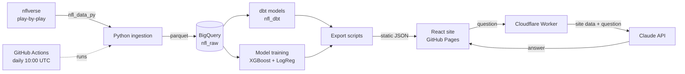

# Sunday Club · NFL Analytics

**An end-to-end NFL analytics platform — from raw play-by-play data to a trained prediction model to a live, auto-refreshing sports website.**

**Live site:** https://tvijayakumar01.github.io/NFL-Analytics-Portfolio/

**Author & owner:** [Tanuj Vijayakumar](https://github.com/Tvijayakumar01) — designed, built, and maintains every part of this project: the data pipeline, warehouse models, machine-learning model, frontend, AI assistant, and automation.

---

## Table of contents

1. [What this project is](#what-this-project-is)
2. [What the site does](#what-the-site-does)
3. [How it works, end to end](#how-it-works-end-to-end)
4. [The prediction model](#the-prediction-model)
5. [Repository structure](#repository-structure)
6. [Running it yourself](#running-it-yourself)
7. [Limitations](#limitations)
8. [Tech stack](#tech-stack)
9. [Author, ownership & credits](#author-ownership--credits)

---

## What this project is

Sunday Club answers a simple question — *who is actually playing well in the NFL, and who is likely to win next?* — using **Expected Points Added (EPA)**, the standard advanced metric for measuring how much each play helps or hurts a team's chance to score.

The project covers the full lifecycle of a data product:

| Stage | What happens |
|---|---|
| **Ingest** | Pulls NFL play-by-play, schedules, and rosters from nflverse |
| **Warehouse** | Loads raw data into Google BigQuery — over 1.2 million plays, 1999 to present |
| **Transform** | dbt models turn raw plays into team-week and player-week efficiency tables |
| **Model** | XGBoost and Logistic Regression predict game winners from recent team form |
| **Export** | Python scripts write static JSON files for the website |
| **Serve** | A React site on GitHub Pages renders everything — no backend server |
| **Ask** | A Cloudflare Worker lets visitors ask questions in plain English, answered by Claude from the site's own data |
| **Automate** | A GitHub Action re-runs the whole pipeline every day |

---

## What the site does

| Page | Purpose |
|---|---|
| **Home** | Sports front page: Player of the Week lead story, auto-generated headlines, this week's picks, top-10 power rankings, next-kickoff countdown, and the model's season record |
| **The Snap** | Weekly recap — Player of the Week, storylines, Team of the Week, and a filterable stat sheet for every player |
| **Locker Room** | All 32 teams — efficiency standings by conference, an offense-vs-defense chart, head-to-head "tale of the tape," and full club rosters with weekly trend charts |
| **The Slate** | Full-season schedule as a scoreboard, with a live countdown and the model's pick on each upcoming game |
| **The Line** | Game-center view of every prediction: win probability, the model's reasoning, and a track record of how past picks turned out |
| **The Huddle** | AI assistant — ask "Who has the best defense?" and get an answer grounded only in this site's data |
| **The Playbook** | How the whole system works, model accuracy, and known limitations |

A live scores ticker runs across the top of every page, and the site works on phones as well as desktops.

---

## How it works, end to end



### 1. Ingestion — `ingestion/`

- **`pull_data.py`** downloads play-by-play, schedules, and weekly rosters for 2021–present using `nfl_data_py` and saves them as parquet files under `data/raw/`.
- **`load_to_bigquery.py`** loads those files into the `nfl_raw` BigQuery dataset (`pbp`, `schedules`, `rosters`), replacing the tables on each run.
- **`backfill_historical.py`** is a one-time job that loads 1999–2020 play-by-play into a **separate** table, `nfl_raw.pbp_historical`. Keeping it separate means the daily reload of recent seasons never wipes out the historical data.

### 2. Transformation — `nfl_dbt/`

dbt models turn raw plays into analysis-ready tables:

| Model | Layer | What it produces |
|---|---|---|
| `stg_pbp` | staging | Clean pass and run plays with a valid EPA value |
| `stg_rosters`, `stg_player_bio` | staging | Player positions, names, and headshots |
| `team_week_epa` | mart | Each team's offensive EPA/play, defensive EPA/play allowed, and success rate, per week |
| `team_rolling_epa` | mart | Each team's average over its **previous four** weeks — the model's inputs |
| `player_week_epa` | mart | Per-player EPA, yards, touchdowns, and turnovers by role (passer, rusher, receiver) |
| `player_rolling_form` | mart | A 4-week "recent form" score per player, shrunk toward the positional average and z-scored so small samples don't dominate |
| `game_training_data` | mart | One row per game joining both teams' trailing form to the final result |

### 3. Modeling and export — `scripts/`

| Script | Output file | Contents |
|---|---|---|
| `export_data.py` | `this_week.json`, `teams.json`, `games.json` | Weekly recaps, Team of the Week, standings, rosters, trends |
| `export_predictions.py` | `predictions.json` | Trains the models and scores every game of the holdout season (the track record) |
| `export_upcoming_predictions.py` | `upcoming_predictions.json` | Retrains on all completed games and predicts the next week |
| `export_schedule.py` | `schedule.json` | Full-season schedule and results |
| `compare_historical_window.py` | *(console report)* | The experiment that decided how much history to train on — see below |

The JSON files are written to `predictions-app/public/data/` and ship with the site. The site needs no database or API server of its own, so it can be hosted free as static files.

### 4. Frontend — `predictions-app/`

A React + TypeScript single-page app built with Vite, styled with Tailwind CSS, animated with Framer Motion, and charted with Recharts. It builds into `docs/`, which GitHub Pages serves directly. Each data file is fetched once and cached for the session.

### 5. AI assistant — `ask-worker/`

The Huddle page sends the visitor's question to a Cloudflare Worker (`worker.js`). The worker:

1. fetches the site's published JSON (standings, rosters, schedule, predictions, weekly recap),
2. sends that data and the question to Claude (`claude-haiku-4-5`) with instructions to answer **only** from the data, in plain English,
3. returns the answer to the browser.

The Anthropic API key lives only in the Worker's environment (`ANTHROPIC_API_KEY`) and never reaches the browser.

### 6. Automation — `.github/workflows/daily-refresh.yml`

Every day at 10:00 UTC, GitHub Actions:

1. pulls the latest NFL data and loads it into BigQuery,
2. runs `dbt run`,
3. runs all four export scripts, retraining the model,
4. rebuilds the React site,
5. commits the refreshed data and build back to `main`, which republishes GitHub Pages.

It can also be triggered by hand from the repository's **Actions** tab.

---

## The prediction model

**Question:** will the home team win?

**Features:** six numbers per game — for each team, the average over its previous four weeks of:

- offensive EPA per play
- defensive EPA per play allowed
- offensive success rate

Only weeks **before** the game are used, so the model never sees information from the game it is predicting.

**Models:**

- **XGBoost** (100 trees, depth 3, learning rate 0.05) — the official pick
- **Logistic Regression** — a simpler baseline shown alongside it

Picks are labeled by the XGBoost win probability: **High** confidence at 70% or more, **Medium** at 60–70%, **Low** below 60%.

**Evaluation:** models are trained on past seasons and scored on the 2025 season, which they never saw during training.

| Model | 2025 accuracy |
|---|---|
| Naive baseline (always pick the home team) | 53.7% |
| Logistic Regression | 63.6% |
| XGBoost — trained on 2021–2024 only | 62.5% |
| **XGBoost — trained on 1999–2024** | **66.2%** |

**The history experiment:** the model originally trained on 2021–2024 only. Older seasons come from a different era of football — different rules, far less passing — so it was not obvious that adding them would help. `compare_historical_window.py` tested this directly: two otherwise identical models, one on recent seasons and one on the full history, scored on the same 2025 games. The full history raised accuracy from 62.5% to 66.2%, so the live model now trains on everything back to 1999.

---

## Repository structure

```
NFL-Analytics-Portfolio/
├── ingestion/               # Pull NFL data and load it into BigQuery
│   ├── pull_data.py
│   ├── load_to_bigquery.py
│   └── backfill_historical.py
├── nfl_dbt/                 # dbt project: staging and mart models
│   └── models/
│       ├── staging/
│       └── marts/
├── scripts/                 # Model training and JSON export
├── predictions-app/         # React + TypeScript frontend (source)
│   ├── public/data/         # Exported JSON the site reads
│   └── src/
│       ├── pages/           # One file per page
│       ├── components/      # Layout, shared UI, sports widgets
│       └── lib/             # Data loaders, formatting, team info
├── docs/                    # Built site, served by GitHub Pages
├── ask-worker/              # Cloudflare Worker for The Huddle
├── .github/workflows/       # Daily refresh automation
└── requirements.txt         # Python dependencies
```

---

## Running it yourself

### Prerequisites

- Python 3.11
- Node.js 20
- A Google Cloud project with BigQuery enabled, and a service-account key saved as `credentials.json` in the project root (it is git-ignored — never commit it)
- *(Optional, for The Huddle)* a Cloudflare account and an Anthropic API key

> The scripts reference the author's GCP project ID, `nfl-analytics-505917`. To run against your own project, change `PROJECT_ID` in the ingestion and export scripts, `database` in `nfl_dbt/models/staging/sources.yml`, and `project` in your dbt profile.

### 1. Python environment

```bash
python -m venv venv
source venv/bin/activate        # Windows: venv\Scripts\activate
pip install -r requirements.txt
```

### 2. dbt profile

Create `~/.dbt/profiles.yml`:

```yaml
nfl_dbt:
  outputs:
    dev:
      type: bigquery
      method: service-account
      project: <your-gcp-project>
      dataset: nfl_dbt
      keyfile: /absolute/path/to/credentials.json
      location: US
      threads: 4
  target: dev
```

### 3. Run the pipeline

```bash
python ingestion/pull_data.py
python ingestion/load_to_bigquery.py
python ingestion/backfill_historical.py      # one time only
cd nfl_dbt && dbt run && cd ..
python scripts/export_data.py
python scripts/export_predictions.py
python scripts/export_upcoming_predictions.py
python scripts/export_schedule.py
```

### 4. Run the website

```bash
cd predictions-app
npm install
npm run dev        # local preview at http://localhost:5173
npm run build      # production build into ../docs
```

### 5. Deploy

- **Website:** push to `main`. GitHub Pages is set to serve the `docs/` folder on `main`.
- **Daily automation:** add your service-account JSON as a repository secret named `GCP_CREDENTIALS`.
- **AI assistant:**
  ```bash
  cd ask-worker
  npx wrangler secret put ANTHROPIC_API_KEY
  npx wrangler deploy
  ```

---

## Limitations

- **No strength-of-schedule adjustment.** A great week against a weak defense counts the same as one against an elite defense.
- **No injuries, weather, or personnel.** The model sees only trailing team efficiency.
- **Early-season weeks lean on last season's form,** because the four-week window carries over across seasons until enough new games are played.
- **Eras are not distinguished.** Pre-2001 football was a different game; the experiment above shows the older data still helps overall.
- **EPA measures efficiency, not wins.** A team can lose on the scoreboard and still post strong EPA.

---

## Tech stack

**Data & ML:** Python, pandas, nfl_data_py, Google BigQuery, dbt Core, scikit-learn, XGBoost
**Frontend:** React, TypeScript, Vite, Tailwind CSS, Framer Motion, Recharts
**Infrastructure:** GitHub Pages, GitHub Actions, Cloudflare Workers
**AI:** Claude (Anthropic API)

---

## Author, ownership & credits

**Tanuj Vijayakumar** — creator, author, and owner of this project.
GitHub: [@Tvijayakumar01](https://github.com/Tvijayakumar01)

Copyright © 2026 Tanuj Vijayakumar. All rights reserved. No license is granted to copy, modify, or redistribute this code without the author's written permission.

**Data:** play-by-play, schedule, and roster data come from the [nflverse](https://github.com/nflverse) project via [nfl_data_py](https://github.com/nflverse/nfl_data_py). Team logos are shown for identification and belong to their respective teams.

This is an independent portfolio project. It is **not affiliated with, endorsed by, or sponsored by the NFL** or any of its teams.
